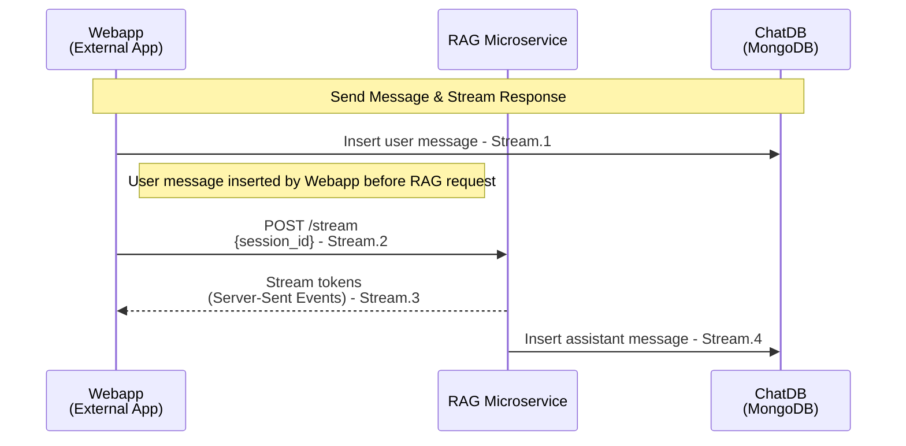

# Generate Response Protocol

This document describes the streaming message protocol used by the RAG Microservice for handling chat requests and responses.

## Sequence Diagram

See the complete sequence diagram below:



## Data Formats & Schemas

### Stream.1: User Message Insertion

**Description**: Webapp inserts the user message to ChatDB BEFORE making the POST /stream request to RAG

**Schema** (as stored in MongoDB):
```json
{
  "_id": "string (ObjectId serialized to string by JSONEncoder)",
  "session_id": "string (ObjectId as string from request)",
  "role": "user",
  "content": "string (user message text)",
  "created_at": "ISO 8601 datetime (e.g., 2026-02-18T10:15:00Z or similar)"
}
```

**Example**:
```json
{
  "_id": "65f7a3d9c1e2b4a5f6g7h8ja",
  "session_id": "65f7a3d9c1e2b4a5f6g7h8i9",
  "role": "user",
  "content": "What are our Q1 revenue targets?",
  "created_at": "2026-02-18T10:15:00Z"
}
```

---

### Stream.2: POST /stream Request

**Description**: Webapp sends request to RAG microservice `/stream` endpoint with session ID

**Request Schema**:
```json
{
  "session_id": "string (ObjectId as string)"
}
```

**Example**:
```json
{
  "session_id": "65f7a3d9c1e2b4a5f6g7h8i9"
}
```

---

### Stream.3: Server-Sent Events Response

**Description**: RAG microservice streams response tokens back to Webapp using Server-Sent Events (SSE)

**Response Headers**:
```
Content-Type: text/event-stream
Transfer-Encoding: chunked
```

**Content Event Format**:
```json
data: {"type": "content", "text": "string (individual LLM text chunk)"}
```

**Content Event Examples**:
```
data: {"type": "content", "text": "Based"}
data: {"type": "content", "text": " on"}
data: {"type": "content", "text": " the"}
data: {"type": "content", "text": " analytics"}
```

**Error Event Format** (if applicable):
```json
data: {"type": "error", "content": "error message"}
```

**Error Event Example**:
```
data: {"type": "error", "content": "LLM Client not connected"}
```

**End of Stream Marker**:
```
data: [DONE]
```

---

### Stream.4: Assistant Message Insertion

**Description**: RAG microservice inserts the complete assistant response to ChatDB after streaming completes

**Schema** (as stored in MongoDB):
```json
{
  "_id": "string (ObjectId serialized to string by JSONEncoder)",
  "session_id": "string (ObjectId as string from request)",
  "role": "assistant",
  "content": "string (complete assistant response text - accumulated from all streamed chunks)",
  "created_at": "ISO 8601 datetime (e.g., 2026-02-18T10:15:30Z or similar)"
}
```

**Example**:
```json
{
  "_id": "65f7a3d9c1e2b4a5f6g7h8jc",
  "session_id": "65f7a3d9c1e2b4a5f6g7h8i9",
  "role": "assistant",
  "content": "Based on the analytics, Q1 targets are $2.5M for Northeast...",
  "created_at": "2026-02-18T10:15:30Z"
}
```

---

## Implementation Notes
- **Memory Windowing**: The RAG microservice applies memory windowing (controlled by `MEMORY_WINDOW_SIZE` env var) before sending messages to the LLM
- **Tool Execution**: During streaming, the LLM may call MCP tools, which are intercepted and executed by the RAG microservice
- **Message Persistence**: Both user and assistant messages are persisted to MongoDB for conversation continuity and history

---

## References

- **API Implementation**: See [api.py](../api.py)
- **LLM Client with MCP**: See [llm_client_with_mcp.py](../llm_client_with_mcp.py)
- **Chat Database Client**: See [core/clients/chat_db_client.py](../core/clients/chat_db_client.py)
- **Raw Sequence Diagram**: See [diagram-stream-message.mmd](./diagram-stream-message.mmd)
