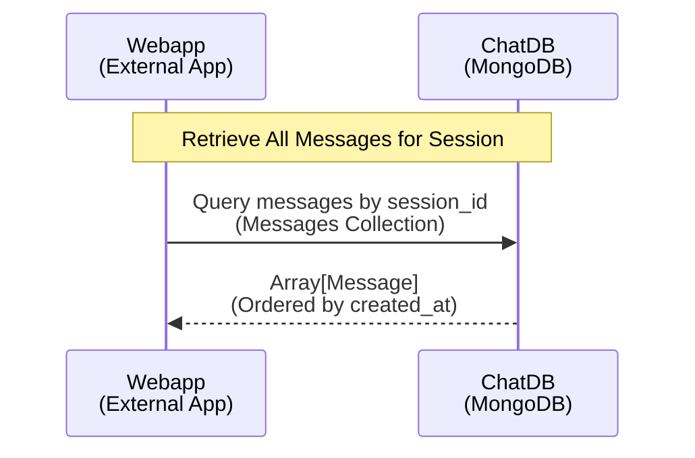

# Message Retrieval Protocol

This document describes how to retrieve all messages for a given session.

## Overview

The message retrieval protocol allows external applications to fetch the complete conversation history for a specific session. Messages are returned in chronological order (sorted by `created_at`).

## Sequence Diagram



## Data Formats & Schemas

### Request: Query Messages by Session

**Description**: External app queries MongoDB `messages` collection for all messages in a session

**Operation**: `query_messages_by_session`

**Required Parameters**:
```json
{
  "session_id": "string (ObjectId as string)"
}
```

**Example Request**:
```json
{
  "session_id": "65f7a3d9c1e2b4a5f6g7h8i9"
}
```

---

### Response: Array of Messages

**Description**: ChatDB returns all messages for the session, ordered chronologically

**Response Schema**:
```json
[
  {
    "id": "string (ObjectId serialized to string)",
    "session_id": "string (ObjectId as string)",
    "role": "string (enum: system|user|assistant|tool)",
    "content": "string (message text)",
    "created_at": "ISO 8601 datetime"
  }
]
```

**Example Response**:
```json
[
  {
    "id": "65f7a3d9c1e2b4a5f6g7h8ja",
    "session_id": "65f7a3d9c1e2b4a5f6g7h8i9",
    "role": "user",
    "content": "What are our Q1 revenue targets?",
    "created_at": "2026-02-18T10:15:00Z"
  },
  {
    "id": "65f7a3d9c1e2b4a5f6g7h8jb",
    "session_id": "65f7a3d9c1e2b4a5f6g7h8i9",
    "role": "assistant",
    "content": "Based on the analytics data, Q1 targets are: Northeast Region $2.5M, Southeast Region $1.8M...",
    "created_at": "2026-02-18T10:15:15Z"
  },
  {
    "id": "65f7a3d9c1e2b4a5f6g7h8jc",
    "session_id": "65f7a3d9c1e2b4a5f6g7h8i9",
    "role": "user",
    "content": "Can you break that down by product line?",
    "created_at": "2026-02-18T10:16:00Z"
  }
]
```

---

## Message Roles

Messages can have the following roles:

| Role | Description |
|------|-------------|
| `system` | System-generated messages (context, instructions) |
| `user` | Messages from the external application user |
| `assistant` | Responses from the LLM |
| `tool` | Intermediate results from MCP tool execution |

---

## Usage Notes

- **Chronological Order**: Messages are always returned sorted by `created_at` in ascending order (oldest first)
- **Complete History**: This operation retrieves ALL messages in the session (no pagination in basic protocol)
- **Role Filtering**: External apps can filter messages by role on the client side if needed
- **Timestamp Format**: All timestamps use ISO 8601 format with timezone information
