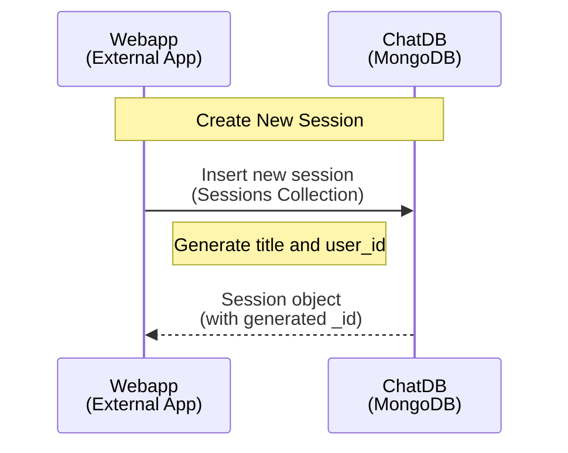

# Session Creation Protocol

This document describes how to create a new conversation session.

## Overview

The session creation protocol allows external applications to initialize a new conversation session. A session is a container for a series of messages between a user and the RAG microservice.

## Sequence Diagram



## Data Formats & Schemas

### Request: Create New Session

**Description**: External app creates a new session record in the `sessions` collection

**Operation**: `insert_session`

**Required Parameters**:
```json
{
  "user_id": "string (ObjectId as string)",
  "title": "string (user-defined session title)",
  "summary": "string (optional, initial summary or empty string)"
}
```

**Example Request**:
```json
{
  "user_id": "55f7a3d9c1e2b4a5f6g7h8i0",
  "title": "Q1 Planning Discussion",
  "summary": ""
}
```

---

### Response: Created Session

**Description**: ChatDB returns the newly created session with auto-generated `_id` and timestamps

**Response Schema**:
```json
{
  "id": "string (ObjectId as string, auto-generated)",
  "user_id": "string (ObjectId as string)",
  "title": "string",
  "summary": "string (optional)",
  "updated_at": "ISO 8601 datetime (auto-generated)",
  "created_at": "ISO 8601 datetime (auto-generated)"
}
```

**Example Response**:
```json
{
  "id": "65f7a3d9c1e2b4a5f6g7h8i9",
  "user_id": "55f7a3d9c1e2b4a5f6g7h8i0",
  "title": "Q1 Planning Discussion",
  "summary": "",
  "updated_at": "2026-02-18T15:30:00Z",
  "created_at": "2026-02-18T15:30:00Z"
}
```

---

## Field Specifications

| Field | Type | Auto-Generated | Description |
|-------|------|---|---|
| `id` | ObjectId (string) | ✓ | Unique session identifier |
| `user_id` | ObjectId (string) | | Identifier of the user owning this session |
| `title` | String | | Human-readable session name/topic |
| `summary` | String | | Optional summary of conversation (can be empty initially) |
| `created_at` | ISO 8601 | ✓ | Session creation timestamp |
| `updated_at` | ISO 8601 | ✓ | Last modification timestamp (same as `created_at` on creation) |

---

## Usage Notes

- **Session ID**: The returned `id` must be used in all subsequent operations (message insertion, retrieval, streaming)
- **User ID**: Must be a valid ObjectId string representing the user. External apps are responsible for managing user identity
- **Title**: Should be descriptive (e.g., "Q1 Planning", "Customer Feedback Analysis", "Project Kickoff")
- **Summary**: Initially empty, updated after conversation or by external app logic
- **Timestamps**: Both created at the same time on session creation; `updated_at` changes when session is modified
- **ObjectId Serialization**: All `_id` fields are returned as strings for REST API compatibility

---

## Workflow: Create Session → Add Messages → Stream Response

1. **Create Session**
   ```
   POST /sessions
   {
     "user_id": "55f7a3d9c1e2b4a5f6g7h8i0",
     "title": "Q1 Planning"
   }
   Response: { "id": "65f7a3d9c1e2b4a5f6g7h8i9", ... }
   ```

2. **Insert User Message** (in MongoDB directly or via API)
   ```
   {
     "session_id": "65f7a3d9c1e2b4a5f6g7h8i9",
     "role": "user",
     "content": "What are our targets?"
   }
   ```

3. **Stream LLM Response**
   ```
   POST /stream
   {
     "session_id": "65f7a3d9c1e2b4a5f6g7h8i9"
   }
   Response: Server-Sent Events stream
   ```

4. **Retrieve All Messages** (after streaming completes)
   ```
   GET /sessions/65f7a3d9c1e2b4a5f6g7h8i9/messages
   Response: Array of all messages in chronological order
   ```

---

## Implementation Example

```python
from core.clients.chat_db_client import ChatMongoClient
from bson import ObjectId

db = ChatMongoClient()
user_id = ObjectId()  # Generate or use existing user ID

# Create a new session
session = db.insert_session(user_id, "Q1 Planning Discussion")

print(f"Session created: {session['_id']}")
print(f"Title: {session['title']}")
print(f"Created at: {session['created_at']}")

# Use session['_id'] for all subsequent operations
session_id = session['_id']
```

---

## Error Handling

**Invalid User ID**:
```json
{
  "error": "invalid_user_id",
  "message": "User ID must be a valid ObjectId string"
}
```

**Missing Required Field**:
```json
{
  "error": "missing_field",
  "message": "Field 'title' is required"
}
```

**Database Connection Error**:
```json
{
  "error": "database_error",
  "message": "Could not connect to MongoDB"
}
```

---

## Notes on Session Lifecycle

- **Active**: Session begins immediately upon creation
- **Updating**: `updated_at` is refreshed each time messages are added
- **Archiving**: External apps can implement archival logic (e.g., marking sessions as inactive)
- **Deletion**: Sessions can be soft-deleted by external logic (not yet implemented in base service)
